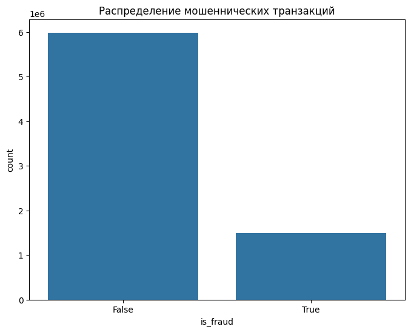
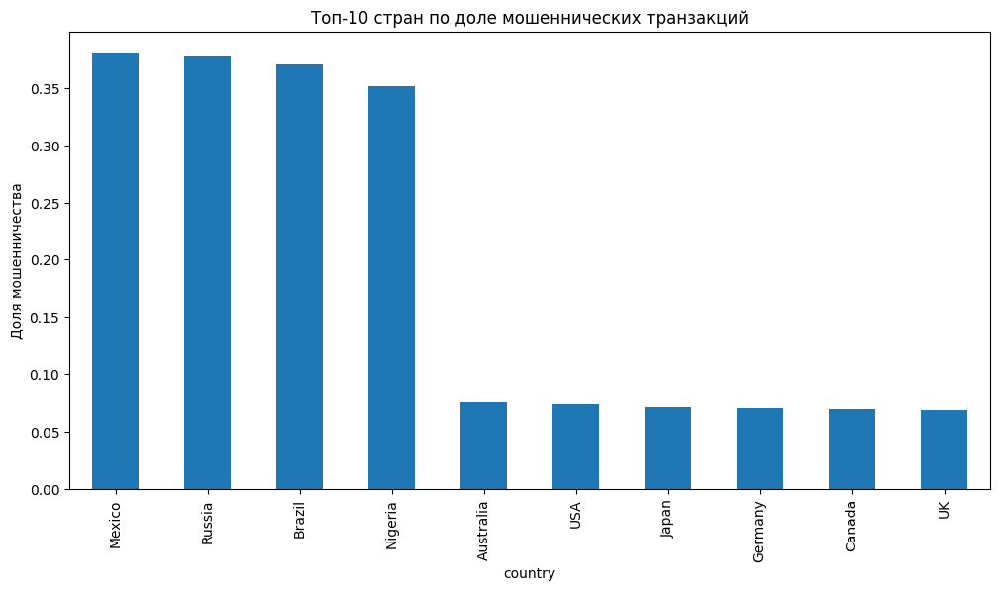
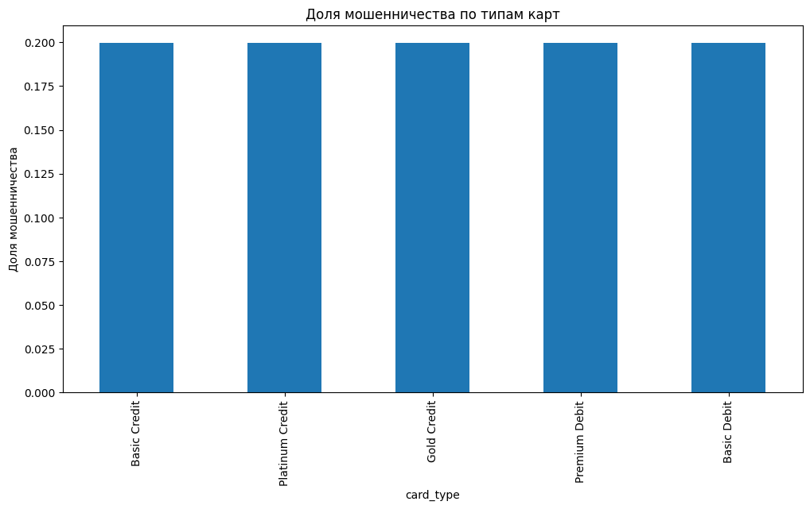
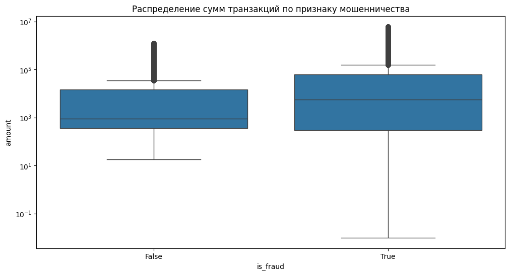
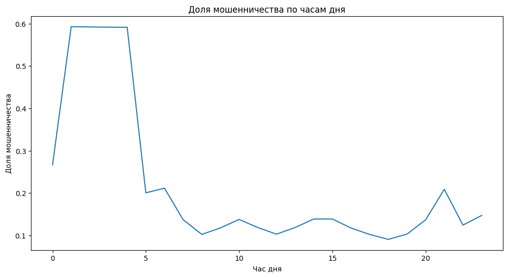

# Анализ мошеннических транзакций

## Визуализации и анализ данных

### 1. Распределение мошеннических транзакций

- Доля мошеннических транзакций составляет **19.97%**, это слишком высоко для реальных данных.

### 2. Доля мошенничества по категориям вендоров

- Все категории демонстрируют почти одинаковый уровень мошенничества (~19.9-20.0%)

### 3. Топ-10 стран по доле мошеннических транзакций

- Четкое разделение на две группы:
  - **Высокий риск**: Мексика (38.0%), Россия (37.7%), Бразилия (37.1%), Нигерия (35.1%)
  - **Низкий риск**: Австралия (7.6%), США (7.5%), Япония (7.1%), Германия (7.1%), Канада (7.0%), Великобритания (6.9%)

### 4. Доля мошенничества по типам карт

- Все типы карт показывают практически идентичный уровень мошенничества (~19.97%)

### 5. Распределение сумм транзакций по признаку мошенничества

- Мошеннические транзакции имеют более широкий разброс сумм, включая экстремально высокие значения

### 6. Доля мошенничества по часам дня

- Ожидается рост мошенничества ночью (00:00-05:00) и возможен всплеск вечером (18:00-22:00)

## Гипотезы

### Продуктовые гипотезы
1. **Гипотеза о повышенном риске в определенных категориях**:
   - Транзакции в категориях "Путешествия" и "Развлечения" имеют значительно более высокий риск мошенничества.
   - **Ценность**: Позволит сфокусировать усилия по проверке на наиболее рискованных категориях.

2. **Гипотеза о географических паттернах**:
   - Транзакции, совершенные за пределами страны проживания клиента, имеют более высокий риск мошенничества, особенно в определенных странах.
   - **Ценность**: Позволит разработать дифференцированные правила проверки для международных транзакций.

3. **Гипотеза о сумме транзакции**:
   - Крупные транзакции чаще являются мошенническими.

### Технические гипотезы
1. **Гипотеза о поведенческих аномалиях**:
   - Резкое увеличение количества транзакций или суммы расходов за последний час является индикатором потенциального мошенничества.
   - **Ценность**: Позволит выявлять подозрительную активность на основе поведенческих паттернов.

2. **Гипотеза о цифровых следах**:
   - Транзакции, совершенные с новых или редко используемых устройств (на основе `device_fingerprint`), имеют более высокий риск мошенничества.
   - **Ценность**: Позволит идентифицировать подозрительные устройства и блокировать их.

3. **Гипотеза о временных паттернах**:
   - Мошенничество концентрируется в определенные часы (ночь/вечер).

## Выводы
1. География — сильный предиктор мошенничества. Транзакции в развивающихся странах (Мексика, Россия, Бразилия, Нигерия) в 5 раз рискованнее.
2. Крупные транзакции требуют особого внимания, так как мошеннические операции имеют более широкий разброс сумм.
3. Все категории вендоров и типы карт демонстрируют практически одинаковый уровень мошенничества.
4. Временные паттерны могут быть важным индикатором мошеннической активности.

## Рекомендации
1. Ввести дополнительные проверки для транзакций в странах с высоким риском (Мексика, Россия, Бразилия, Нигерия).
2. Реализовать двухфакторную аутентификацию для крупных платежей.
3. Исследовать временные закономерности (часы/дни недели) для выявления периодов повышенного риска.
4. Проанализировать комбинации факторов (например, крупные суммы + рискованные страны) для более точного выявления мошенничества.
